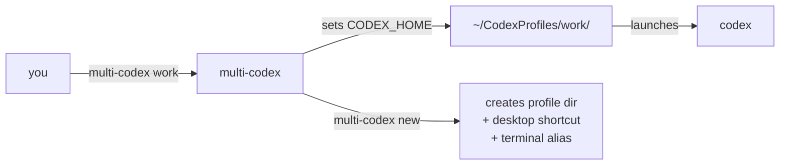

# multi-codex · 多账户启动器

> Run multiple Codex CLI accounts at the same time. No logout, no bullshit.  
> 同时运行多个 Codex CLI 账户。不用反复登录，爽。

[](#install)

⭐ **If this saves you time, star the repo.** ⭐

---



**That's the whole trick.** Codex looks at `CODEX_HOME` to decide where its config lives. multi-codex just points it at different folders. Each folder = one account. Done.

**就这么简单。** Codex 通过 `CODEX_HOME` 环境变量决定读哪个配置目录。multi-codex 把它指向不同文件夹，每个文件夹就是一个独立账户。

---

## Install · 安装

You need Node.js 22+ and Codex CLI installed first.  
先装好 Node.js 22+ 和 Codex CLI。

```bash
npm install -g @openai/codex
```

Then pick your OS · 然后选你的系统：

**macOS / Linux:**
```bash
/bin/bash -c "$(curl -fsSL https://raw.githubusercontent.com/ProGambler67/multi-codex/main/install.sh)"
```

**Windows (PowerShell):**
```powershell
irm https://raw.githubusercontent.com/ProGambler67/multi-codex/main/install.ps1 | iex
```

---

## Quick start · 快速上手

```bash
multi-codex new work     # 创建 work 账户
multi-codex new personal # 创建 personal 账户

work                     # 打开 work，首次需要登录
personal                 # 打开 personal，两边可以同时跑
```

To use profile names as commands, add this to your shell config · 把下面加到 shell 配置里就能直接用名字启动：

```bash
# macOS / Linux (~/.zshrc or ~/.bashrc):
export PATH="$HOME/CodexProfiles/bin:$PATH"

# Windows PowerShell:
$env:PATH += ";$env:USERPROFILE\CodexProfiles\bin"
```

---

## Profile types · 账户类型

| Type · 类型 | What it does · 说明 |
|---|---|
| `full` (default) | Everything isolated — auth, config, sessions, skills. Fresh start. |
| `shared` (`--shared`) | Shares config/skills with system install. Only auth is separate. |
| `cli` (`--cli`) | Always opens in terminal, never the desktop app. For terminal lovers. |

```bash
multi-codex new work              # full · 完全独立
multi-codex new work --shared     # shared · 共享配置
multi-codex new work --cli        # terminal-only · 纯终端
```

You can also force CLI mode globally · 也可以全局强制终端模式：

```bash
export MULTICODEX_CLI=1    # all profiles skip the desktop app
```

---

## Commands · 命令

| Command | What it does |
|---|---|
| `new <name> [--shared] [--cli]` | Create a profile · 创建账户 |
| `new <name> --from <tpl>` | Create from template · 从模板创建 |
| `list` | Show all profiles · 列出所有账户 |
| `status` | Running state, type, size · 运行状态 |
| `rename <old> <new>` | Rename · 重命名 |
| `delete <name>` | Delete (asks first) · 删除（会确认） |
| `clone <src> <dest>` | Copy a profile · 克隆账户 |
| `template save <p> <name>` | Save as template · 保存为模板 |
| `template list` | List templates · 模板列表 |
| `template delete <name>` | Delete template · 删除模板 |
| `export <name> [path]` | Backup (tar.gz / zip) · 备份 |
| `import <file> [name]` | Restore backup · 还原 |
| `doctor` | Health check · 诊断 |
| `stats` | Disk usage · 空间占用 |
| `update` | Update from GitHub · 更新 |
| `completion` | Tab-completion setup · 补全 |
| `<name> [args...]` | Launch profile · 启动账户 |

---

## Env vars · 环境变量

| Variable | Purpose · 作用 |
|---|---|
| `MULTICODEX_HOME` | Where profiles live (default: `~/CodexProfiles`) |
| `MULTICODEX_APP` | Custom Codex binary path |
| `MULTICODEX_CLI` | Set to `1` to force terminal mode for all profiles |

---

## Files · 文件

```
├── multi-codex          # CLI — bash (macOS / Linux)
├── multi-codex.ps1      # CLI — PowerShell (Windows)
├── install.sh / .ps1    # Installers
├── setup.sh / .ps1      # Setup wizards
├── uninstall.sh / .ps1  # Uninstallers
├── icon.icns            # macOS icon
└── README.md
```

---

## Uninstall · 卸载

**macOS / Linux:**
```bash
/bin/bash -c "$(curl -fsSL https://raw.githubusercontent.com/ProGambler67/multi-codex/main/uninstall.sh)"
```

**Windows:**
```powershell
irm https://raw.githubusercontent.com/ProGambler67/multi-codex/main/uninstall.ps1 | iex
```

---

⭐ **Star this repo if it's useful.** ⭐
