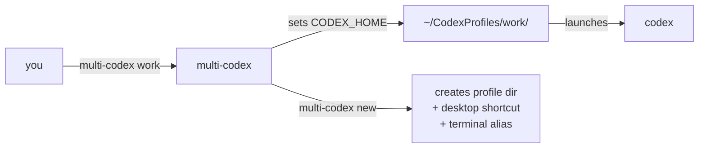

# multi-codex · 多账户启动器

> Run multiple Codex CLI accounts at the same time. No logout, no bullshit.  
> 同时运行多个 Codex CLI 账户。不用反复登录。

[](https://github.com/Spielewoy/multi-codex)
[](https://github.com/Spielewoy/multi-codex)

<p align="right">
  <a href="#english"></a>
  <a href="#chinese"></a>
</p>

⭐ **If this saves you time, star the repo.** ⭐



**The whole trick:** Codex looks at `CODEX_HOME` for its config. multi-codex points it at different folders. One folder = one account. Done.

---

<h2 id="english">🇬🇧 English</h2>

### Install

1. **Install Node.js 22+** — [nodejs.org](https://nodejs.org/)
2. **Install Codex CLI:**
   ```bash
   npm install -g @openai/codex
   ```
3. **Install multi-codex:**

   **macOS / Linux:**
   ```bash
   /bin/bash -c "$(curl -fsSL https://raw.githubusercontent.com/Spielewoy/multi-codex/main/install.sh)"
   ```

   **Windows (PowerShell as Admin):**
   ```powershell
   irm https://raw.githubusercontent.com/Spielewoy/multi-codex/main/install.ps1 | iex
   ```

   Or manually: download `multi-codex` / `multi-codex.ps1`, drop it somewhere in your `PATH`, and `chmod +x` it.

### Quick start

```bash
multi-codex new work        # create a profile
multi-codex new personal    # create another
work                        # launch work (first time asks for login)
personal                    # launch personal — both can run at once
```

Add profile names as commands:
```bash
# macOS / Linux — add to ~/.zshrc or ~/.bashrc:
export PATH="$HOME/CodexProfiles/bin:$PATH"

# Windows — add to your system PATH:
# %USERPROFILE%\CodexProfiles\bin
```

### Profile types

| Flag | Behaviour |
|---|---|
| *(default)* | **Full profile** — completely isolated. Own auth, config, sessions, skills. |
| `--shared` | **Shared** — symlinks config, skills, agents, prompts, plugins, schemas, hooks, git-hooks, scripts, manifests, memories & vendor_imports from `~/.codex/`. Only auth is separate. |
| `--cli` | **Terminal-only** — skips the desktop app, always opens in your terminal. |

```bash
multi-codex new work              # full
multi-codex new work --shared     # shared config
multi-codex new work --cli        # terminal mode
```

Force CLI globally: `export MULTICODEX_CLI=1`

### All commands

| Command | Description |
|---|---|
| `new <name> [--shared] [--cli]` | Create a profile |
| `new <name> --from <tpl>` | Create from a saved template |
| `list` | Show all profiles |
| `status` | Running state, type, last used, size |
| `rename <old> <new>` | Rename a profile |
| `delete <name>` | Delete a profile (confirms first) |
| `clone <src> <dest>` | Copy a profile |
| `template save <profile> <name>` | Save profile as reusable template |
| `template list` | List templates |
| `template delete <name>` | Delete a template |
| `export <name> [path]` | Backup to `.tar.gz` / `.zip` |
| `import <file> [name]` | Restore from backup |
| `doctor` | System health check |
| `stats` | Disk usage per profile |
| `update` | Update from GitHub |
| `completion` | Tab-completion setup |
| `<name> [args...]` | Launch a profile, forwards args to Codex |

### Environment variables

| Variable | What it does |
|---|---|
| `MULTICODEX_HOME` | Override profile storage (default: `~/CodexProfiles`) |
| `MULTICODEX_APP` | Override Codex binary path |
| `MULTICODEX_CLI` | Set to `1` to force terminal mode globally |

### Uninstall

**macOS / Linux:**
```bash
/bin/bash -c "$(curl -fsSL https://raw.githubusercontent.com/Spielewoy/multi-codex/main/uninstall.sh)"
```

**Windows:**
```powershell
irm https://raw.githubusercontent.com/Spielewoy/multi-codex/main/uninstall.ps1 | iex
```

---

<h2 id="chinese">🇨🇳 中文</h2>

### 安装

1. **安装 Node.js 22+** — [nodejs.org](https://nodejs.org/)
2. **安装 Codex CLI：**
   ```bash
   npm install -g @openai/codex
   ```
3. **安装 multi-codex：**

   **macOS / Linux：**
   ```bash
   /bin/bash -c "$(curl -fsSL https://raw.githubusercontent.com/Spielewoy/multi-codex/main/install.sh)"
   ```

   **Windows（管理员 PowerShell）：**
   ```powershell
   irm https://raw.githubusercontent.com/Spielewoy/multi-codex/main/install.ps1 | iex
   ```

   或手动下载 `multi-codex` / `multi-codex.ps1`，放到 `PATH` 里，给执行权限。

### 快速上手

```bash
multi-codex new work        # 创建 work 账户
multi-codex new personal    # 创建 personal 账户
work                        # 启动 work，首次需登录
personal                    # 启动 personal，两边可同时跑
```

把账户名变成终端命令：
```bash
# macOS / Linux — 加到 ~/.zshrc 或 ~/.bashrc：
export PATH="$HOME/CodexProfiles/bin:$PATH"

# Windows — 加到系统 PATH：
# %USERPROFILE%\CodexProfiles\bin
```

### 账户类型

| 参数 | 说明 |
|---|---|
| *(默认)* | **完全独立** — 自己的认证、配置、会话、技能，互不干扰 |
| `--shared` | **共享模式** — 配置/技能/代理链接到 `~/.codex/`，仅认证独立 |
| `--cli` | **纯终端** — 跳过桌面应用，永远在终端里打开 |

```bash
multi-codex new work              # 完全独立
multi-codex new work --shared     # 共享配置
multi-codex new work --cli        # 纯终端模式
```

全局强制终端：`export MULTICODEX_CLI=1`

### 全部命令

| 命令 | 说明 |
|---|---|
| `new <name> [--shared] [--cli]` | 创建账户 |
| `new <name> --from <tpl>` | 从模板创建 |
| `list` | 列出所有账户 |
| `status` | 运行状态、类型、最后使用、大小 |
| `rename <old> <new>` | 重命名 |
| `delete <name>` | 删除（会确认） |
| `clone <src> <dest>` | 克隆账户 |
| `template save <profile> <name>` | 保存为模板 |
| `template list` | 模板列表 |
| `template delete <name>` | 删除模板 |
| `export <name> [path]` | 备份为 `.tar.gz` / `.zip` |
| `import <file> [name]` | 从备份还原 |
| `doctor` | 系统诊断 |
| `stats` | 各账户磁盘占用 |
| `update` | 从 GitHub 更新 |
| `completion` | 设置 Tab 补全 |
| `<name> [args...]` | 启动账户，参数转发给 Codex |

### 环境变量

| 变量 | 作用 |
|---|---|
| `MULTICODEX_HOME` | 自定义存储位置（默认 `~/CodexProfiles`） |
| `MULTICODEX_APP` | 自定义 Codex 可执行文件路径 |
| `MULTICODEX_CLI` | 设为 `1` 全局强制终端模式 |

### 卸载

**macOS / Linux：**
```bash
/bin/bash -c "$(curl -fsSL https://raw.githubusercontent.com/Spielewoy/multi-codex/main/uninstall.sh)"
```

**Windows：**
```powershell
irm https://raw.githubusercontent.com/Spielewoy/multi-codex/main/uninstall.ps1 | iex
```

---

### Files · 项目文件

```
├── multi-codex          # CLI — bash (macOS / Linux)
├── multi-codex.ps1      # CLI — PowerShell (Windows)
├── install.sh / .ps1    # Installers · 安装器
├── setup.sh / .ps1      # Setup wizards · 设置向导
├── uninstall.sh / .ps1  # Uninstallers · 卸载器
├── icon.icns            # macOS icon
└── README.md
```

---

⭐ **Star this repo if it's useful. 有用的话点个 Star。** ⭐
